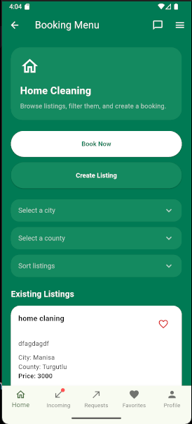
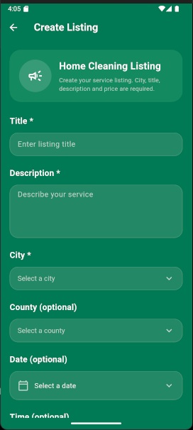
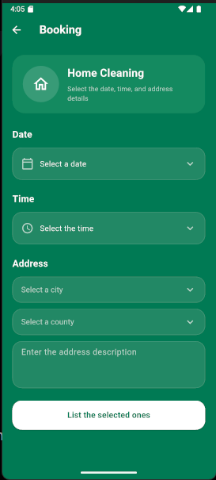
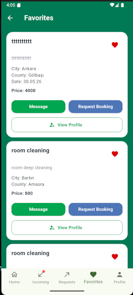

# CleanCare

CleanCare is a Flutter-based mobile service platform that connects customers with cleaning service providers. The application was developed as a Computer Engineering graduation project.

## Features

* User registration, sign-in, and password reset with Firebase Authentication
* Service listing creation with title, description, and price
* Province and district selection covering all 81 provinces of Türkiye
* Date and time selection for service availability
* Reservation and service request management
* Favorite listings
* User profiles and reviews
* Real-time data updates with Cloud Firestore

## Technologies

* Flutter
* Dart
* Firebase Core
* Firebase Authentication
* Cloud Firestore
* Firebase Storage
* Google Fonts
* Material Design Icons

## Getting Started

### Prerequisites

* Flutter SDK
* Android Studio or another supported IDE
* Android emulator or physical device
* A Firebase project

### Installation

1. Clone the repository:

```bash
git clone https://github.com/rumeysakarakecili/CleanCare.git
```

2. Open the project directory:

```bash
cd CleanCare
```

3. Install the dependencies:

```bash
flutter pub get
```

4. Connect the application to your own Firebase project using the FlutterFire CLI.

5. Run the application:

```bash
flutter run
```

## Firebase

The application uses Firebase Authentication, Cloud Firestore, and Firebase Storage. Firebase access must be protected with appropriate Authentication, Firestore Security Rules, and Storage Security Rules.

## Project Structure

```text
lib/        Application source code
assets/     Images and local data
android/    Android platform configuration
ios/        iOS platform configuration
test/       Flutter tests
```

## Screenshots

<table>
  <tr>
    <td align="center"><b>Welcome</b><br></td>
    <td align="center"><b>Login</b><br></td>
    <td align="center"><b>Home</b><br></td>
  </tr>
  <tr>
    <td align="center"><b>Create Listing</b><br></td>
    <td align="center"><b>Booking</b><br></td>
    <td align="center"><b>Favorites</b><br></td>
  </tr>
</table>

## Author

[Rumeysa Karakeçili](https://github.com/rumeysakarakecili)
